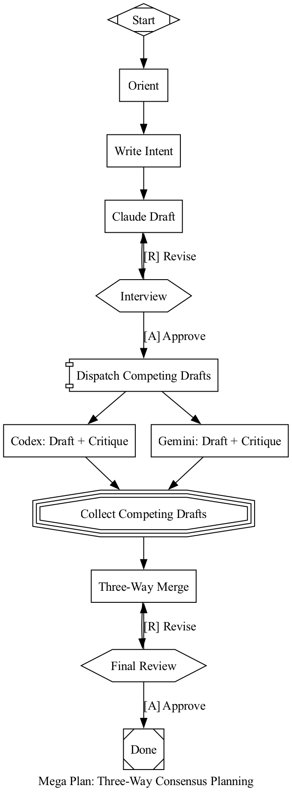
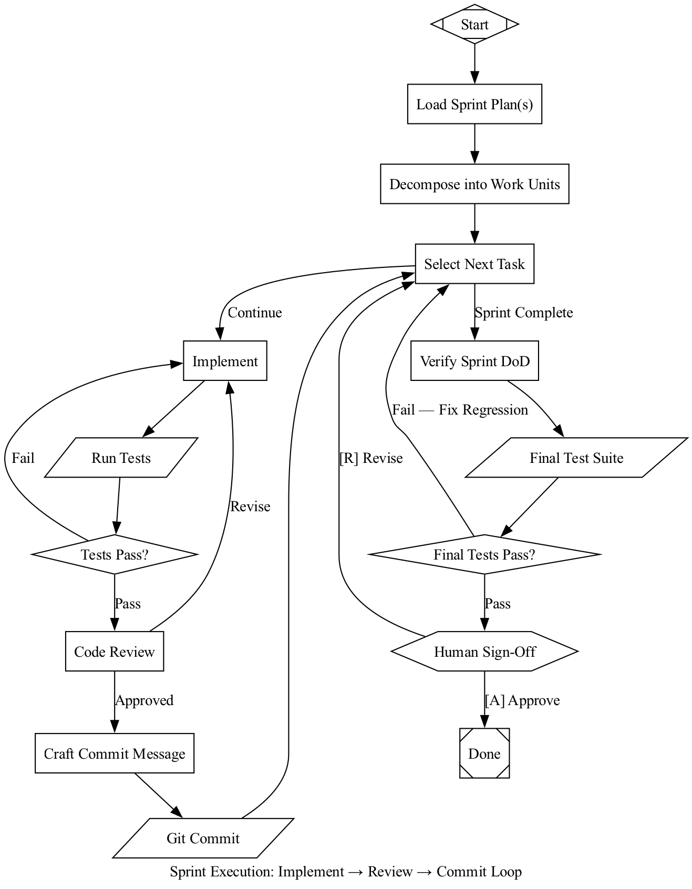

# attractor-scala

Step right up: this is a Scala 3 Attractor engine with clean wiring, deterministic routing, and enough safety rails to keep your 2 AM incident queue quiet.

No mystery glue, no magic state, no "it depends" edge picking. You feed it DOT, it runs a real pipeline.

## What You Get

- Full Attractor-style DOT pipeline execution
- Built-in pipelines for developer, evaluator, factory, megaplan, and sprint execution
- Deterministic edge selection with explicit priority rules
- Human gates (`wait.human`) plus `--auto-approve` for unattended runs
- Atomic checkpoints after each node for resume/recovery
- Structured per-stage logs under `.attractor/logs`

## Quick Start

### Prereqs

- JDK 17+
- `sbt` 1.10+

### Build and Test

```bash
sbt compile
sbt test
```

### List Built-In Pipelines

```bash
sbt "project attractor" "run list"
```

### Run a Built-In Pipeline

```bash
sbt "project attractor" "run run megaplan --goal 'Plan rollout for RBAC changes' --auto-approve"
```

### Run a Custom `.dot` File

```bash
sbt "project attractor" "run run ./my-flow.dot --goal 'Refactor auth middleware' --auto-approve"
```

### Resume from Checkpoint

```bash
sbt "project attractor" "run run sprint_execution --goal 'Ship sprint tasks' --checkpoint .attractor/logs/run-<id>/checkpoint.json"
```

### API Keys (Real LLM Mode)

Set at least one key:

- `ANTHROPIC_API_KEY`
- `OPENAI_API_KEY`
- `GEMINI_API_KEY` (or `GOOGLE_API_KEY`)

No key set? The engine runs in simulated mode so you can still validate flow behavior.

## How The Engine Behaves

Your DOT pipeline goes through a fixed lifecycle:

1. Parse: DOT source is parsed into a graph.
2. Transform: variable/style transforms are applied.
3. Validate: lint/structure checks run before execution.
4. Execute: handlers run node-by-node with retry policy.
5. Checkpoint: state is written after each node.

### Edge Selection Priority (Deterministic)

When a node finishes, outgoing edges are chosen in this order:

1. Matching `condition`
2. Outcome-preferred label
3. Outcome-suggested next node IDs
4. Highest `weight`
5. Lexical tie-break

So yes, it is deterministic; no, it does not pick paths by vibes.

### Human Gates

- `wait.human` nodes present labeled choices.
- `[A]` and `[R]` labels are commonly used for approve/revise loops.
- `--auto-approve` always selects the first available option.

### Logs and Artifacts

Each run creates `.attractor/logs/run-<id>/` with:

- `checkpoint.json`
- `<node-id>/prompt.md`
- `<node-id>/response.md`
- `<node-id>/status.json`
- tool-node outputs: `stdout.txt`, `stderr.txt`

## Built-In Pipelines

| Name | Purpose |
|---|---|
| `plan_build_verify` | Plan -> sprint breakdown -> implementation -> QA loop |
| `evaluator` | Independent evaluation flow with approval/rejection outcomes |
| `factory` | End-to-end dev + evaluator integration flow |
| `megaplan` | Multi-agent planning with three-way consensus merge |
| `sprint_execution` | Task loop: implement -> test -> review -> commit |

## New Flow Diagrams

### `megaplan`

DOT source: [`attractor/src/main/resources/pipelines/megaplan.dot`](attractor/src/main/resources/pipelines/megaplan.dot)



### `sprint_execution`

DOT source: [`attractor/src/main/resources/pipelines/sprint-execution.dot`](attractor/src/main/resources/pipelines/sprint-execution.dot)



## Programmatic Usage

```scala
import ai.attractor.pipeline.engine.PipelineRunner
import ai.attractor.pipeline.pipelines.Pipelines

val outcome = PipelineRunner.fromDotSource(
  dotSource = Pipelines.default,
  logsRoot = ".attractor/logs"
)
```

Take it for a spin. If the pipeline loops forever, it is not haunted; it needs better gates, weights, or retry bounds.
