# attractor-scala

> *Where types compose and effects align,*
> *where pipelines flow through graphs divine,*
> *no nulls to fear, no threads to fight—*
> *the compiler guards your code at night.*
> *In monads wrapped, your futures bright,*
> *Scala makes the Attractor right.*

A Scala 3 implementation of the [Attractor specification](https://github.com/strongdm/attractor) — a DOT-based pipeline runner for orchestrating multi-stage AI workflows.

Attractor defines LLM pipelines as directed graphs in Graphviz DOT syntax. Nodes are tasks (LLM calls, human gates, parallel fan-outs), edges are transitions with conditions and weights, and the engine handles traversal, retries, checkpointing, and human interaction. This implementation covers the full spec using Scala 3, cats-effect, and fs2.

## Why Scala

Scala is the strongest language choice for a pipeline orchestrator because it eliminates entire categories of bugs at compile time while providing the most expressive concurrency model available on the JVM.

### Algebraic effects make concurrency correct by construction

Pipeline orchestration is fundamentally about managing concurrent, effectful computations — LLM calls that may fail, human gates that block indefinitely, parallel fan-outs that must synchronize. cats-effect's `IO` monad makes every side effect explicit in the type signature. A handler that calls an LLM returns `IO[Outcome]`, not `Outcome` — the compiler enforces that callers handle the effectful nature of the operation. There is no way to accidentally fire-and-forget an LLM call or silently swallow an error. Resource safety (connections, file handles, subprocess lifecycles) is guaranteed by `Resource[IO, A]` with bracket semantics — cleanup runs even on cancellation or fiber failure.

### Streaming pipelines with backpressure

fs2 streams are pull-based and resource-safe. When the engine streams events to a frontend, backpressure propagates automatically — a slow consumer doesn't cause unbounded memory growth. Parallel handler branches use `fs2.Stream.parEvalMapUnordered` with bounded concurrency, and each branch gets an isolated context snapshot via immutable case class copying. No locks, no shared mutable state, no defensive cloning — the type system prevents data races at compile time.

### Exhaustive pattern matching eliminates edge selection bugs

The 5-step edge selection algorithm is the heart of the engine. In Scala, the outcome type is a sealed trait — the compiler verifies that every case is handled. Missing a branch is a compile error, not a runtime surprise. Combined with `Option` for nullable fields (no null checks scattered through handler code) and `Either` for parse results (no exception-based control flow), the type system catches the exact class of bugs that pipeline orchestrators are most vulnerable to: unhandled states, missing conditions, and silent failures.

### Immutable data structures prevent checkpoint corruption

Pipeline state is represented as immutable case classes. Context propagation through the graph creates new snapshots — there is no mutable state to corrupt during concurrent execution. Checkpoints serialize cleanly because the data is already values, not references to shared mutable objects. Resume from checkpoint is a function call, not a reconstruction of mutable state.

### Zero-boilerplate extensibility

New handlers implement a single trait method:

```scala
trait Handler:
  def execute(node: Node, context: Context, graph: Graph, logsRoot: String): IO[Outcome]
```

New lint rules implement `LintRule` with `def apply(graph: Graph): List[Diagnostic]`. Custom transforms, LLM providers, and interviewer modes all follow the same pattern — a trait with a single abstract method. Scala's given instances and extension methods allow type class-based extensibility without inheritance hierarchies or runtime reflection.

## Architecture

```
attractor-scala/
├── unified-llm/            Provider-agnostic LLM client
│   ├── model/              Unified message/content/tool types
│   ├── api/                Generate, Stream, GenerateObject APIs
│   ├── provider/           Adapters for Anthropic, OpenAI, Gemini
│   ├── util/               Retry policies, SSE parsing
│   └── middleware/         Request/response interceptors
├── coding-agent/           Coding agent runtime
│   ├── session/            Agent session lifecycle (IO-based)
│   ├── tool/               Tool registry and built-in tools
│   ├── profile/            Provider-specific configurations
│   ├── env/                Execution environment abstraction
│   └── event/              Typed event stream
├── attractor/              Pipeline engine
│   ├── parser/             Three-phase DOT parser (strip → tokenize → parse)
│   ├── engine/             Core execution loop and checkpoint-aware runner
│   ├── handler/            Pluggable handler registry (8 built-in types)
│   ├── state/              Immutable context, checkpointing, outcomes
│   ├── condition/          Condition expression evaluator
│   ├── validation/         12 lint rules across three severity levels
│   ├── stylesheet/         CSS-like model configuration with specificity cascade
│   ├── transform/          AST transforms (variable expansion, stylesheet)
│   ├── interviewer/        Human-in-the-loop abstraction
│   └── pipelines/          Embedded pipeline definitions (.dot files)
└── build.sbt
```

### How a pipeline runs

1. **Parse** — The DOT parser strips comments, tokenizes (handling quoted strings, qualified identifiers, hyphenated names), and builds a `Graph` via recursive descent. Parse errors are `Either[String, Graph]` — no exceptions.
2. **Transform** — Variable expansion replaces `$goal` in prompts. The stylesheet transform applies CSS-like model rules with specificity cascade (universal < class < ID).
3. **Validate** — 12 lint rules check structural correctness (start/exit nodes, reachability via BFS, edge targets), semantic validity (condition syntax, retry targets), and conventions (type names, fidelity modes). Errors block execution; warnings don't.
4. **Execute** — The engine traverses from the start node. Each node's handler is resolved from the registry, executed within `IO` with retry policy, and the outcome drives edge selection through a deterministic 5-step algorithm.
5. **Checkpoint** — After each node, state is atomically saved. Resume restores context, completed nodes, and retry counters. Goal gates are enforced before exit.

### Edge selection

After a node completes, outgoing edges are evaluated in strict priority order:

1. **Condition match** — Edges with `condition` expressions that evaluate to true against the current context and outcome
2. **Preferred label** — If the outcome suggests a label, match it (normalized: lowercase, trimmed)
3. **Suggested next IDs** — Explicit node IDs from the outcome
4. **Highest weight** — Among unconditional edges, highest `weight` wins
5. **Lexical tiebreak** — Alphabetical by target node ID

## Unified LLM Client

The `unified-llm` module provides a single interface across LLM providers, built on http4s and circe for type-safe HTTP and JSON handling.

Key capabilities:
- **Streaming with tool loops** — `Stream` pauses on tool calls, executes them via `IO`, and resumes. `Generate` runs blocking tool loops up to `maxToolRounds`.
- **Structured output** — `GenerateObject` validates responses against JSON schemas with fallback markdown fence extraction.
- **Middleware** — Composable request/response interceptors for logging, metrics, or request modification.
- **Unified types** — Messages, content blocks (text, image, audio, document, tool calls, thinking), and usage tracking work identically across Anthropic, OpenAI, and Gemini.

## Included Pipelines

### Plan-Build-Verify (`developer.dot`)

A four-stage software development pipeline: high-level planning (Claude Opus) → sprint breakdown (Claude Opus) → implementation (Codex) → QA verification (Claude Opus). QA failure loops back to implementation with feedback. Goal gates ensure quality before exit.

```mermaid
flowchart TD
    start(["Begin"])
    plan["High-Level Plan<br/><i>claude-opus-4-6</i>"]
    sprints["Sprint Breakdown<br/><i>claude-opus-4-6</i>"]
    impl["Implement Code<br/><i>gpt-5.3-codex</i>"]
    qa{"QA Verification<br/><i>claude-opus-4-6</i>"}
    done(["Done"])

    start --> plan
    plan --> sprints
    sprints --> impl
    impl --> qa

    qa -- "QA Passed" --> done
    qa -- "QA Passed (partial)" --> done
    qa -. "QA Failed (loop_restart)" .-> impl
```



### Evaluator (`evaluator.dot`)

A four-stage evaluation pipeline for reviewing submissions against a project vision: orchestration (Claude Opus) → tool building (Codex) → QA testing (Claude Opus) → visionary judgment (Claude Opus). The visionary maintains the high-level goal and returns structured, actionable feedback.

## Getting Started

### Prerequisites

- JDK 17+
- [sbt](https://www.scala-sbt.org/) 1.10+

### Build

```bash
sbt compile
```

### Test

```bash
sbt test
```

### Run a pipeline

```scala
import ai.attractor.pipeline.pipelines.Pipelines
import ai.attractor.pipeline.engine.PipelineRunner

// Run the default Plan-Build-Verify pipeline
val outcome = PipelineRunner.fromDotSource(
  Pipelines.default,
  logsRoot = "/tmp/attractor-logs"
)
```

## Spec Compliance

This implementation covers the full [Attractor specification](https://github.com/strongdm/attractor), including:

- Complete DOT subset parser with chained edges, subgraphs, default blocks, and multi-line attributes
- All 8 built-in handler types (start, exit, codergen, wait.human, conditional, parallel, fan-in, tool, manager loop)
- 5-step edge selection algorithm with condition evaluation
- Goal gate enforcement with retry target fallback chain
- Exponential backoff retry policies
- Immutable context with deep copy via case class copying for parallel isolation
- Atomic checkpointing with crash recovery and resume
- CSS-like model stylesheet with specificity cascade
- Composable AST transforms (variable expansion, stylesheet application)
- 12 built-in lint rules with extensible rule interface
- Human-in-the-loop via Interviewer abstraction
- Context fidelity modes
- Event streaming for pipeline lifecycle observability
