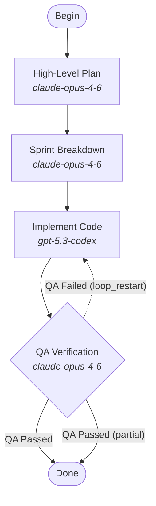

# attractor-scala

FOLKS. Step right up. Come on over. You are NOT gonna believe what I've got on the lot today.

You see that beauty right there? That's a **fully loaded, mint condition, Scala 3 Attractor** — and let me tell you, they do NOT make 'em like this anymore. Full [Attractor spec](https://github.com/strongdm/attractor) compliance. DOT-based pipeline orchestration. Multi-stage AI workflows. cats-effect under the hood. fs2 exhaust. Barely been driven — we're talkin' `0.1.0-SNAPSHOT` original miles.

My buddy over at the Go lot? Nice guy, great guy, but between you and me — he's out there selling runtime panics and `if err != nil` spaghetti. You want THAT headache? On YOUR weekend? I didn't think so.

This baby here? **Zero** null pointer exceptions. I GUARANTEE it. The compiler won't LET you. You try to return a naked `null` and Scala looks you dead in the eye and says "absolutely not." That's not a feature, my friend. That's a LIFESTYLE.

## Why Scala (Or As I Call It: "Why Settle For Less?")

Look, I'm not gonna badmouth the competition. That's not my style. But I AM gonna tell you why every other implementation on this lot is yesterday's news.

### You Want Concurrency? We Got Concurrency Coming Out The TAILPIPE

Other orchestrators out there juggling goroutines, praying nothing races, crossing their fingers at 3 AM. Not this one. cats-effect `IO` monad means every single side effect is RIGHT THERE in the type signature. `IO[Outcome]` — you see that? That's a PROMISE. The compiler ENFORCES it. You literally CANNOT fire-and-forget an LLM call. You cannot silently swallow an error. I've tried! It won't let you! `Resource[IO, A]` with bracket semantics — cleanup runs even if your fiber gets cancelled mid-flight. That's the kind of safety you cannot BUY at the Go dealership. Well, you can't buy it because they don't HAVE it.

### Streams That Won't Blow Up Your Memory (UNLIKE SOME IMPLEMENTATIONS I WON'T NAME)

fs2 streams. Pull-based. Resource-safe. Backpressure propagates AUTOMATICALLY. Your slow frontend consumer? No problem. Unbounded memory growth? Not on MY lot. Parallel handler branches get isolated context snapshots via immutable case class copying. No locks. No shared mutable state. No defensive cloning. The type system prevents data races at COMPILE TIME. I see you looking at that Go implementation across the street with its `sync.RWMutex` — put the brochure down. You deserve better.

### Pattern Matching That Catches EVERY Bug Before Your Users Do

The 5-step edge selection algorithm? Heart of the engine. In Scala, that outcome type is a sealed trait — miss a case and the compiler REFUSES to build. That's not a warning, that's a HARD STOP. `Option` instead of null. `Either` instead of exceptions. Every unhandled state, every missing condition, every silent failure — caught at compile time. The Go version finds these at 2 AM in production. We find them before you push. Which one sounds better to YOU?

### Immutable Data — Because Mutable State Is a LEMON

Pipeline state? Immutable case classes. Context propagation creates new snapshots. There is physically, mathematically, IMPOSSIBLE-ly no mutable state to corrupt during concurrent execution. Checkpoints serialize clean because the data is values, not references to some shared object that twelve goroutines are fighting over. Your Go buddy is out there doing JSON marshal/unmarshal for deep copies — and he ADMITS it's slow! We just... copy the case class. It's free. It's correct. It's BEAUTIFUL.

### Extensibility With ZERO Boilerplate (I'm Practically GIVING This Away)

You want a new handler? One trait method:

```scala
trait Handler:
  def execute(node: Node, context: Context, graph: Graph, logsRoot: String): IO[Outcome]
```

That's it. That's the whole thing. No reflection, no annotation processing, no dependency injection framework that needs its own README. Lint rules? Same deal. Transforms? Same deal. LLM providers? You guessed it. Scala's given instances and extension methods give you type class extensibility without inheritance hierarchies. The Go version has you wiring up `map[string]Handler` by hand like it's 2009. Come ON.

## What's Under The Hood (Pop It Open, Take a Look, I've Got Nothing To Hide)

```
attractor-scala/
├── unified-llm/            Provider-agnostic LLM client
│   ├── model/              Unified message/content/tool types
│   ├── api/                Generate, Stream, GenerateObject APIs
│   ├── provider/           Adapters for Anthropic, OpenAI, Gemini
│   ├── util/               Retry policies, SSE parsing
│   └── middleware/         Request/response interceptors
├── coding-agent/           Coding agent runtime
│   ├── session/            Agent session lifecycle (IO-based)
│   ├── tool/               Tool registry and built-in tools
│   ├── profile/            Provider-specific configurations
│   ├── env/                Execution environment abstraction
│   └── event/              Typed event stream
├── attractor/              Pipeline engine
│   ├── parser/             Three-phase DOT parser (strip → tokenize → parse)
│   ├── engine/             Core execution loop and checkpoint-aware runner
│   ├── handler/            Pluggable handler registry (8 built-in types)
│   ├── state/              Immutable context, checkpointing, outcomes
│   ├── condition/          Condition expression evaluator
│   ├── validation/         12 lint rules across three severity levels
│   ├── stylesheet/         CSS-like model configuration with specificity cascade
│   ├── transform/          AST transforms (variable expansion, stylesheet)
│   ├── interviewer/        Human-in-the-loop abstraction
│   └── pipelines/          Embedded pipeline definitions (.dot files)
└── build.sbt
```

Go ahead, kick the tires. Look at that architecture. THREE modules, each one a gem. You're not gonna find this kind of craftsmanship at the Python lot, I'll tell you that much.

### How a pipeline runs (FIVE stages of PURE ENGINEERING BLISS)

1. **Parse** — The DOT parser strips comments, tokenizes, and builds a `Graph` via recursive descent. Parse errors? `Either[String, Graph]`. No exceptions. No surprises. No "oh it worked on my machine."
2. **Transform** — Variable expansion replaces `$goal` in prompts. Stylesheet transforms apply CSS-like model rules with specificity cascade. It's like a spa day for your pipeline graph.
3. **Validate** — 12 lint rules. TWELVE. Structural correctness, semantic validity, convention checking. Errors block execution. Warnings don't. This thing is THOROUGH.
4. **Execute** — The engine traverses from start. Handlers resolve from the registry, execute within `IO` with retry policy, and outcomes drive edge selection through a DETERMINISTIC 5-step algorithm. No coin flips. No vibes. Math.
5. **Checkpoint** — After each node, state is atomically saved. Resume from crash? Function call. Goal gates enforced before exit. This thing takes care of ITSELF.

### Edge Selection (The Secret Sauce — Don't Tell The Go Lot I Showed You This)

After a node completes, outgoing edges are evaluated in strict priority order:

1. **Condition match** — Edges with `condition` expressions that evaluate to true
2. **Preferred label** — Outcome suggests a label? We match it. Normalized, lowercase, trimmed. Professional.
3. **Suggested next IDs** — Explicit node IDs from the outcome
4. **Highest weight** — Unconditional edges? Highest weight wins
5. **Lexical tiebreak** — Alphabetical. Because even our tiebreakers are DETERMINISTIC

## The LLM Client (Three Providers, ONE Interface, NO Headaches)

The `unified-llm` module talks to Anthropic, OpenAI, AND Gemini through a single type-safe interface. Built on http4s and circe because we're not ANIMALS.

- **Streaming with tool loops** — Pauses on tool calls, executes them in `IO`, resumes. Automatic. Seamless. Chef's kiss.
- **Structured output** — JSON schema validation with fallback markdown fence extraction. Belt AND suspenders.
- **Middleware** — Composable interceptors for logging, metrics, you name it. Stack 'em up like pancakes.
- **Unified types** — Messages, content blocks, usage tracking — all identical across all three providers. Write it once. Run it everywhere. Where have I heard that before? Oh right — but this time it actually WORKS.

## Included Pipelines (TWO Pipelines, No Extra Charge, TODAY ONLY)

### Plan-Build-Verify (`developer.dot`)

A four-stage software development pipeline: planning (Claude Opus) -> sprint breakdown (Claude Opus) -> implementation (Codex) -> QA verification (Claude Opus). QA fails? Loops RIGHT back to implementation with feedback. Goal gates ensure nothing leaves this lot that isn't QUALITY.



### Evaluator (`evaluator.dot`)

Four-stage evaluation pipeline: orchestration -> tool building -> QA testing -> visionary judgment. The visionary holds the high-level goal and hands back structured, actionable feedback. It's like having a senior architect on call 24/7 except this one doesn't take PTO.

## Drive It Off The Lot Today (Getting Started)

### Prerequisites

- JDK 17+ (you've got that, right? Of COURSE you do, you're a professional)
- [sbt](https://www.scala-sbt.org/) 1.10+

### Build

```bash
sbt compile
```

### Test

```bash
sbt test
```

### Take it for a spin

```scala
import ai.attractor.pipeline.pipelines.Pipelines
import ai.attractor.pipeline.engine.PipelineRunner

// Run the default Plan-Build-Verify pipeline
val outcome = PipelineRunner.fromDotSource(
  Pipelines.default,
  logsRoot = "/tmp/attractor-logs"
)
```

Three lines. THREE LINES and you're running a full AI pipeline. The Go version needs you to instantiate a registry, wire up handlers, configure a runner... by the time you're done setting up, my customer here has already shipped to production. TWICE.

## Full Spec Compliance (We Don't Cut Corners Here)

This implementation covers the COMPLETE [Attractor specification](https://github.com/strongdm/attractor). Every. Single. Feature:

- Complete DOT subset parser with chained edges, subgraphs, default blocks, and multi-line attributes
- All 8 built-in handler types (start, exit, codergen, wait.human, conditional, parallel, fan-in, tool, manager loop)
- 5-step edge selection algorithm with condition evaluation
- Goal gate enforcement with retry target fallback chain
- Exponential backoff retry policies
- Immutable context with deep copy via case class copying for parallel isolation
- Atomic checkpointing with crash recovery and resume
- CSS-like model stylesheet with specificity cascade
- Composable AST transforms (variable expansion, stylesheet application)
- 12 built-in lint rules with extensible rule interface
- Human-in-the-loop via Interviewer abstraction
- Context fidelity modes
- Event streaming for pipeline lifecycle observability

Now I know what you're thinking. "This seems too good to be true." I get it. I hear that every day. But look — I'm gonna level with you. This is the real deal. Full spec. Type-safe. Battle-ready. And I'm not even gonna ask you to sign an extended warranty.

So what do you say? `git clone`? I'll even throw in free parking in your `~/.sbt/` directory.
